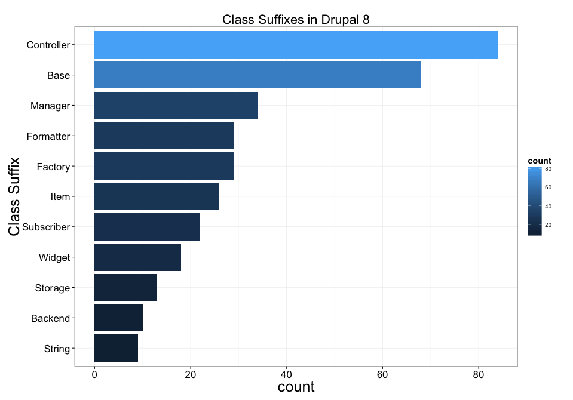

---
.main-title
# Naming things

---

## Hi, I'm Mark Sonnabaum

### [@msonnabaum](http://twitter.com/msonnabaum)

### Performance engineer at [Acquia](//acquia.com)

---

# Why should I care about naming?

---
.quote

> Communication with people is the purpose of class names. As far as the computer is concerned, classes could simply be numbered.

<cite>Kent Beck. Implementation Patterns</cite>

<!-- Good names make it easier for other developers (including future you)
to work on your code -->

<!-- Naming is the first step towards good design -->

---
.code
```php
<?php

namespace Drupal\Core;

class SystemListing {
```

---

# What does this class do?

---


# **System**Listing

---

# System**Listing**

---

# It lists the systems?

---
.code

```php
<?php

namespace Drupal\Core;

/**
 * Returns information about system object files (modules,
 * themes, etc.).
 *
 * This class requires the list of profiles to be scanned (see
 * \Drupal\Core\SystemListing::scan) to be passed into the
 *  constructor. Also, info files are not parsed.
 */
class SystemListing {
```

---
.code

```php

  function scan($mask, $directory, $key = 'name') {
```

<!-- 
Sort of resembles scandir, except scandir's $directory argument is a single directory,
not a directory to look in in several locations
-->

---

# "scan" what?


---
.code
```php
  /**
   * @param string $mask
   *   The preg_match() regular expression for the files to
   *   find. The expression must be anchored and use
   *   DRUPAL_PHP_FUNCTION_PATTERN for the file name part before
   *   the extension, since the results could contain matches
   *   that do not present valid Drupal extensions otherwise.
```
---
.code
```php
  /**
   * @param string $directory
   *   The subdirectory name in which the files are found. For
   *   example, 'modules' will search all 'modules' directories
   *   and their sub-directories as explained above.
```
---
.code
```php
  /**
   * @param string $key
   *   (optional) The key to be used for the associative array
   *   returned.
   *   Possible values are:
   *   - 'uri' for the file's URI.
   *   - 'filename' for the basename of the file.
   *   - 'name' for the name of the file without the extension.
   *   For 'name' and 'filename' only the highest-precedence file
   *   is returned.
   *   Defaults to 'name'.
```
---
.code
```php
  /**
   * @return array
   *   An associative array of file objects, keyed on the chosen
   *   key. Each element in the array is an object containing
   *   file information, with properties:
   *   - 'uri': Full URI of the file.
   *   - 'filename': File name.
   *   - 'name': Name of file without the extension.
   */
  function scan($mask, $directory, $key = 'name') {
```
---

# Still pretty confusing

---
.code

```php
  protected function moduleData($module) {
    // First, find profiles.
    $profiles_scanner = new SystemListing();
    $all_profiles = $profiles_scanner->scan(
      '/^' . DRUPAL_PHP_FUNCTION_PATTERN . '\.profile$/',
      'profiles'
    );
    $profiles = array_keys(
      array_intersect_key($this->moduleList, $all_profiles)
    );

    // Now find modules.
    $modules_scanner = new SystemListing($profiles);
    $this->moduleData = $modules_scanner->scan(
      '/^' . DRUPAL_PHP_FUNCTION_PATTERN . '\.module$/',
      'modules'
    );
```

---
.code
```php
  protected function moduleData($module) {
    // First, find profiles.
    $extension_finder = new ExtensionFinder();
    $all_profiles = $extension_finder->findProfiles();

    $profiles = array_keys(
      array_intersect_key($this->moduleList, $all_profiles)
    );

    // Now find modules.
    $this->moduleData = $extension_finder->findModules($profiles);
```

---

# Look for better vocabulary in comments

---
.code

```php
namespace Drupal\Core;

class SystemListingInfo extends SystemListing {
```

---

# Oh no

---
.code

```php
namespace Drupal\Core;

/**
 * Returns information about system object files (modules,
 * themes, etc.).
 *
 * This class finds the profile directories itself and also
 * parses info files.
 */
class SystemListingInfo extends SystemListing {
```

---

# How did this happen?

---
.code
```php
function drupal_system_listing($mask, $directory,
                                 $key = 'name', $min_depth = 1) {
```
---

## Refactoring functions into classes is an opportunity to rethink it's role

---

## What is
## **Drupal\field\Field**?

<!-- Bad naming caused by over-generalization -->

---
.code

```php
namespace Drupal\field;

class Field {

  public static function fieldInfo() {
    return \Drupal::service('field.info');
  }

}
```

---

# WHAT

---
.code

```php
/**
 * @file
 * Contains \Drupal\field\Field.
 */

namespace Drupal\field;

/**
 * Static service container wrapper for Field.
 */
class Field {

  /**
   * Returns the field info service.
   *
   * @return \Drupal\field\FieldInfo
   *   Returns a field info object.
   */
  public static function fieldInfo() {
    return \Drupal::service('field.info');
  }

}
```

---

## Where is for-real **Field**?

---

### Drupal\field\Plugin\Core\Entity\Field

---

## Because **Field**
## is both a
## **Plugin** and an **Entity**

---


## (╯°□°）╯︵ ┻━┻

---


## Naming should express
## **what**, not **how**

---

## **Namespaces** are important

---

## Don't treat them as
## directories to find classes in

---
.title

# Suffixes

---

### Drupal\block\BlockStorageController
### Drupal\block\BlockAccessController
### Drupal\block\BlockRenderController
### Drupal\block\BlockListController
### Drupal\block\BlockFormController

---
# What even is a **controller**

---

## BlockStorageController

---

## BlockStorage

---
.fragment
# 

## BlockAccessController

### This one is tough

---
## BlockRenderController

---
.fragment

## BlockRenderable
## BlockPresenter

---
## BlockListController

---
## BlockList

---
## BlockFormController

---
## BlockForm

---

## Avoid using a shared suffix unless the classes truly play a similar role

---
.image



---

# What does it mean to **Manage**?

---
.code
```php
interface PluginManagerInterface extends DiscoveryInterface,
                                          FactoryInterface,
                                          MapperInterface {
}
```
---
## Manage -> To Discover,
## Construct, and Map

---
.code
```php
/**
 * Provides a breadcrumb manager.
 *
 * Holds an array of path processor objects and uses them to
 * sequentially process a path, in order of processor priority.
 */
class BreadcrumbManager implements BreadcrumbBuilderInterface {

  public function addBuilder(BreadcrumbBuilderInterface $builder,
                               $priority) {}

  public function build(array $attributes) {}
}
```

---

## Manage -> To Build Builders

---
.code
```php

/**
 * Class responsible for initializing each language type.
 */
class LanguageManager {

```

---

## Manage -> To "Initialize"

---
.code
```php
namespace Drupal\Core\Locale;

use Drupal\Core\Extension\ModuleHandlerInterface;

/**
 * Provides list of countries.
 */
class CountryManager implements CountryManagerInterface {
```

---

## Manage -> To List

---
.code
```php
namespace Drupal\system;

/**
 * System Manager Service.
 */
class SystemManager {
  // Checks for requirement severity.
  public function checkRequirements() {}

  // Displays the site status report. Can also be used as a
  // pure check.
  public function listRequirements() {}

  // Fixes anonymous user on MySQL.
  public function fixAnonymousUid() {}

  // Extracts the highest severity from the requirements array.
  public function getMaxSeverity(&$requirements) {}

```

---

## Manage -> To Check and List a different noun

---

# What does it mean to **Manage**?

---

## Manage -> Giving up

---
## What is the difference
## between a **Manager**
## and a **Handler**?

---

## Not much
---

## Avoid **agent nouns**

---

## Find the real responsibility
## in the methods

---

## Reflect the responsibility
## in the class name

---

## If that is difficult, try
## breaking up the class

---

## What if the **agent noun**
## is a **design pattern**?


---

## Sometimes ok
## Depends on the pattern
<!-- respository, strategy? -->

---

## Discovery\InfoHookDecorator

<!-- bad, this is more of a strategy pattern. decorator only spells
out implementation details -->

---

## ContainerBuilder

<!-- good, says what it does -->

---
.title

# How to name things

---
.title2
# Classes

---

## What word would you use
## in conversation a
## with domain expert?

---

## What word would you use in the user interface?

---

## How would you describe the class in a sentance?

---

## Don't be afraid of long names
## *if* it tells a better story

---

## Avoid abbreviation

---
.title2

# Subclasses

---
.quote

> The names of subclasses have two jobs. They need to communicate what class they are like and how they are different.

<cite>Ken Beck. Implementation Patterns</cite>

---
.code
```php
namespace KeyValueStore;

class DatabaseStorage {}

class DatabaseStorageExpirable {}
```

---
.fragment
## When this rule doesn't apply 

### code-sharing inheritance 
### root of another heirarchy that has prefix/suffix


---
.title2

# Methods

---

## Describes a behavior

---
## What is the method
## responsible for?

---

## Decompose methods until this is answerable

---

## Use as many words as
## necessary to reveal intention

---
.title2

# Variables

---
## Avoid hard to name variables by limiting scope

---
.title
# Comments

---
.quote

> When you feel the need to write a comment, first try to refactor the code so that any comment becomes superfluous.

<cite>Martin Fowler, Kent Beck. Refactoring: Improving the Design of Existing Code</cite>

---
.code
```php
protected function moduleData($module) {
    // First, find profiles.
    $profiles_scanner = new SystemListing();
    $all_profiles = $profiles_scanner->scan(
      '/^' . DRUPAL_PHP_FUNCTION_PATTERN . '\.profile$/',
      'profiles'
    );

```
---
.code
```php
  protected function moduleData($module) {
    $extension_finder = new ExtensionFinder();
    $all_profiles = $extension_finder->findProfiles();
```

---


## Naming isn't hard

---

## Domain modeling is hard

---
## Don't settle for the best of many bad options

---

## Refactor until the naming comes naturally

---

## References


- Beck, Kent (2007-10-23). [Implementation Patterns](http://www.amazon.com/Implementation-Patterns-Kent-Beck/dp/0321413091)

- Fowler, Martin; Beck, Kent; Brant, John; Opdyke, William; Roberts, Don (2012-03-09). [Refactoring: Improving the Design of Existing Code](http://www.amazon.com/Refactoring-Improving-Design-Existing-Code/dp/0201485672)

---

# Thanks.

---
